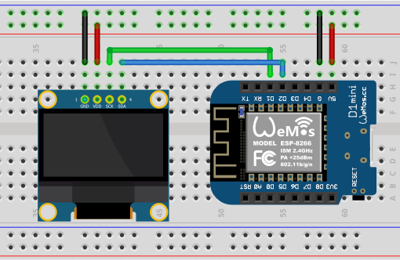

# Bitcoin Ticker
Bitcoin Ticker is Arduino code for `ESP8266` boards. This ticker displays the price of Bitcoin/USD and idicates whether the crypto currency went up or down. The price data comes from the CoinMarketCap API.

(FYI - there are affliliate links here to hardware you might need.)

# Components
* <a target="_blank" href="https://amzn.to/3usDgv8">0.96 Inch OLED Module 128x64 SSD1306</a>
* <a target="_blank" href="https://amzn.to/3fV7l2u">ESP8266 ESP-12 ESP-12F NodeMcu Mini D1 Module</a>
* <a target="_blank" href="https://amzn.to/39TUz0d">Breadboard Kit - I used a half sized breadboard.</a>
* <a target="_blank" href="https://amzn.to/3fXhyeK">Jumper Wires - I've linked my favorite ones.</a>

# Wiring Diagram

# Installation
Connect your `ESP8266` board to your computer and open `bitcoinTicker-esp8266.ino` with the Arduino IDE. 

In `Tools > Board > ESP8266 Boards` select `Generic ESP8266 Module`.

Select the correct port that your `ESP8266` is plugged into via `Tools > Port`. If your board isn't showing up, you might need to install some drivers. A Google Search for `ESP8266 Drivers` should give you what you need.

Hit the `Verify` button. Install any necessary libraries via `Tools > Manage Libraries`. Below is the list of libraries I used in this project. You should be able to find them pretty quick by typing these into the search bar. All libraries are found in the Arduino Library Manger(`Tools > Manage Libraries`.) No special installation is needed outside of their library.

Libraries Used:
* Adafruit_SSD1306 (For the OLED Display)
* ESP8266WiFi (For ESP8266 onboard WiFi)
* Wire
* ESP8266HTTPClient (To make requests to CoinMarketCap)
* ArduinoJson (Used to process JSON data retreived from CoinMarketCap)

Once everything is verified successfully, hit the `Upload` button. If your OLED is wired up correctly, you should see the screen displaying that it's connecting to your network, then it will show the ticker. 

# Usage
Plug Micro-USB into the Arduino and everything should boot up successfully in less than 10 seconds.

# Support You
Whatever you need; questions answered, requests, bugs; make an Issue. I'll get to them as soon as I can.

# Support Me
Support me with some Bitcoin! - Wallet: 1NjSoJX4biGi5hW72NX7eLYvzMVgjChfRA

Or buy me a coffee - Venmo - @AndrewBudziszek